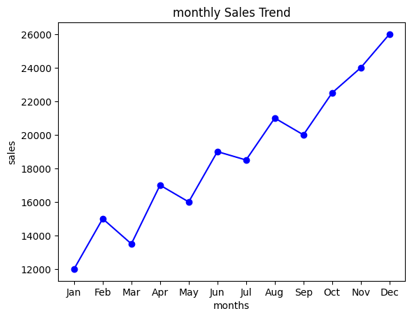
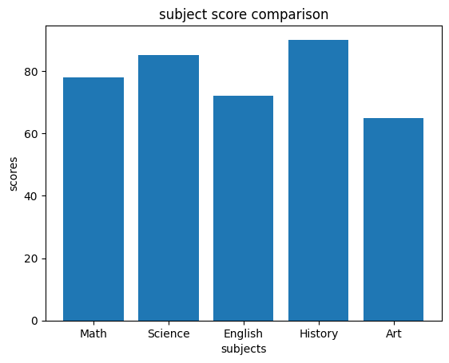
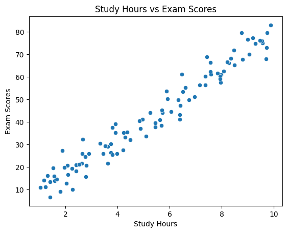
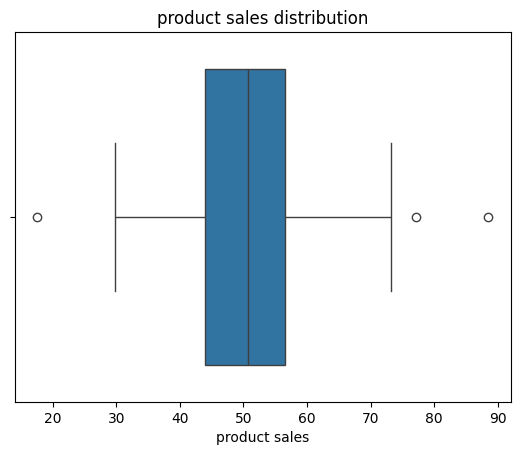

# sales-visualization-analytics
# 📊 Sales Visualization Project

## 📌 Overview
This project focuses on visualizing data using Python.

## 🎯 Tasks Performed
- Created line plot for monthly sales trend
- Created bar chart for subject comparison
- Created scatter plot for study vs exam scores
- Created box plot for product sales distribution

## 🛠 Tools Used
- Python
- Matplotlib
- Seaborn
- Google Colab

## 📊 Visualizations

### Line Plot

### Bar Plot

### Scatter Plot

### Box Plot

## 🚀 How to Run
Open the notebook in Google Colab and run all cells.
